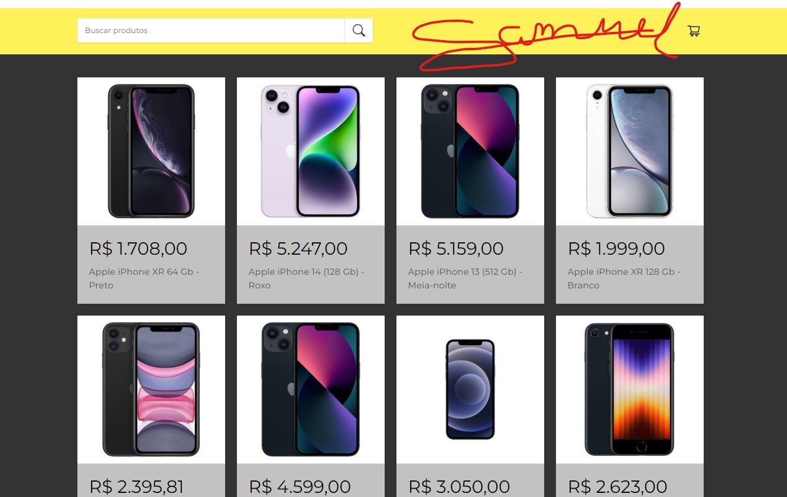

<h1 align="center"> Carrinhos de compras com o React JS</h1>

Projeto recriado através do canal Manual do Dev, para maior entendimento do HTML,CSS,js e React. 

  <a href="#-tecnologias">Tecnologias</a>&nbsp;&nbsp;&nbsp;|&nbsp;&nbsp;&nbsp;
  <a href="#-projeto">Projeto</a>&nbsp;&nbsp;&nbsp;|&nbsp;&nbsp;&nbsp;
  <a href="#-layout">Layout</a>&nbsp;&nbsp;&nbsp;|&nbsp;&nbsp;&nbsp;

 

  

## 💡 Tecnologias

Esse projeto foi desenvolvido com as seguintes tecnologias:

- HTML/CSS/
- React JS
- API do mercado livre

## 💻 Projeto

   📃 Listagem de produtos: exibe uma lista de produtos obtidos da API do Mercado Livre.
    💻Busca de produtos: permite pesquisar produtos com base em palavras-chave, consumindo a API do Mercado Livre para obter os resultados.
    🛒Adição de produtos ao carrinho: permite adicionar produtos ao carrinho de compras.
    Remoção de produtos do carrinho: possibilita remover produtos do carrinho de compras.

## 🔖 Layout

Você pode visualizar o layout do projeto através [DESSE LINK](https://www.youtube.com/@ManualdoDev).

